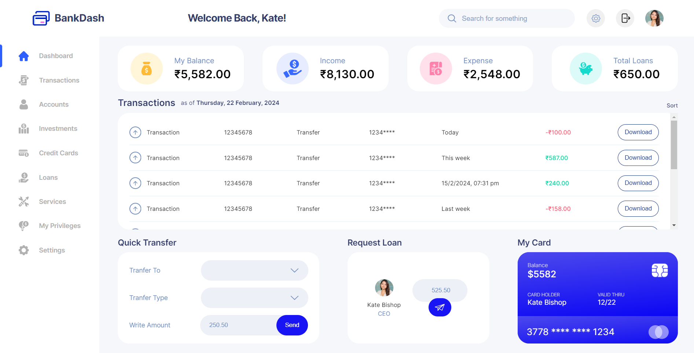

<!-- PROJECT LOGO -->

# BankDash

  

    An awesome, interactive Banking app dashboard with responsive design!
    <a href="https://github.com/amittam104">View Demo</a>
  

<!-- TABLE OF CONTENTS -->

  
Table of Contents

  <ol>
    <li>
      <a href="#about-the-project">About The Project</a>
      <ul>
        <li><a href="#built-with">Built With</a></li>
      </ul>
    </li>
    <li><a href="#usage">Usage</a></li>
    <li><a href="#roadmap">Roadmap</a></li>
    <li><a href="#contact">Contact</a></li>
    <li><a href="#acknowledgments">Acknowledgments</a></li>
  </ol>

<!-- ABOUT THE PROJECT -->

## About The Project

BankDash is a modern interactive and responsive banking app dashboard. Featured with multiple user login, money transfer, loan request, internationalized currency and date-time etc.

Highlights:

- You can switch between four different accoutns to check the functionality.
- You can request money via loan and tranfer money to other accounts.
- The dates, time and currency is dependent on the locale and currency of the account.

(<a href="#readme-top">back to top</a>)

### Built With

This project is built with HTML5, CSS3 and JavaScript.

(<a href="#readme-top">back to top</a>)

<!-- USAGE EXAMPLES -->

## Usage

- Click on the Live Demo. <a href="https://github.com/amittam104">View Demo</a>
- Click on the settings icon on the navigation panel on the top right corner.
- Copy and pasete one of the account username and password into the input field and log in.
- Play around with Dashboard - Transfer money, Request loan
- Click on logout button besides profile picture at the top right corner
- Use the settings button again to get log in details for other accounts

(<a href="#readme-top">back to top</a>)

<!-- ROADMAP -->

## Roadmap

- [x] Basic Functionality
- [x] Change profile picture
- [x] Internationalization of date and time
- [x] Transactions sorting
- [x] Internationalization of currency

(<a href="#readme-top">back to top</a>)

<!-- CONTACT -->

## Contact

Amit Tambulkar - [@attambulkar](https://twitter.com/attambulkar) - amittambulkar@gmail.com

Project Link: [https://github.com/amittam104/BankDash](https://github.com/amittam104/BankDash)

(<a href="#readme-top">back to top</a>)

<!-- ACKNOWLEDGMENTS -->

## Acknowledgments

- [README template](https://github.com/othneildrew/Best-README-Template)
- [Project Idea - JS Course](https://www.udemy.com/course/the-complete-javascript-course/)
- [Figma Design Template](https://www.figma.com/file/v81hYyTudz1AjlCAXGJ4UM/BankDash---A-banking-app-Dashboard?type=design&node-id=217-58&mode=design&t=C1cLmSJeaon6JWpZ-0)

(<a href="#readme-top">back to top</a>)

